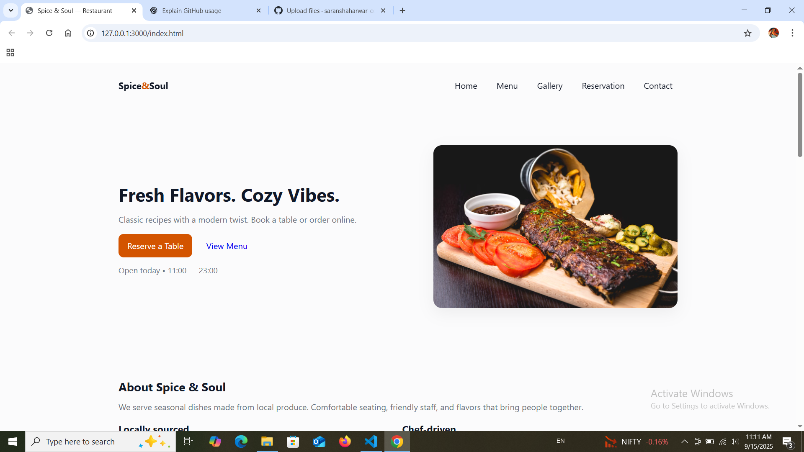

# 🍽️ Restaurant Landing Page — Spice & Soul

## 📖 Overview
A modern, responsive **restaurant landing page** built with **HTML, CSS, and JavaScript**.  
It showcases menu items, gallery, reservations, and contact details.  

👉 **Live Demo:** [Click Here](https://saranshahwar-code.github.io/Restaurant-landing/)

---

## 🚀 Features
- Fully responsive (mobile, tablet, desktop)
- Hero section with restaurant branding
- About section with highlights
- Menu section with dishes and pricing
- Image gallery
- Online reservation form
- Contact details with map
- Footer with social links

---

## 🛠️ Tech Stack
- HTML5  
- CSS3 (Flexbox + Grid)  
- JavaScript (vanilla)  
- Deployed via **GitHub Pages**

---

## 📂 Project Structure

---

## 📸 Screenshot

---

## 📄 License
This project is licensed under the [MIT License](LICENSE).

---

## ✨ Author
**Saransh Aharwar** — Frontend Developer  
- GitHub: [@saranshahwar-code](https://github.com/saranshahwar-code)  
